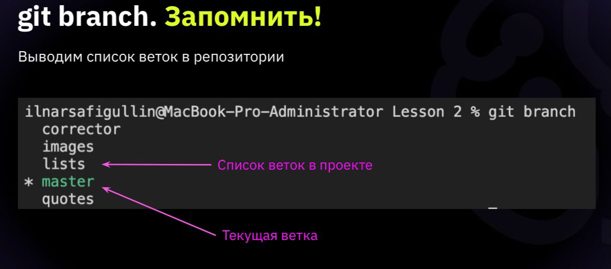

# Инструкция для работы с Git и удалёнными репозиториями

## Что такое Git? 

Git - один из видов систем контроля версий. С помощью Git вы можете *сравнивать*, *анализировать*, *редактировать*, *сливать изменения* и *возвращаться назад* к последнему сохранению. Проще говоря, мы можем посмотреть как менялись файлы программы, на всех этапах разработки и при необходимости вернуться назад и что-то отредактировать. 
## Подготовка репозитория
*Repository* — (хранилище) — место, где хранятся и поддерживаются какие-либо данные. Чаще всего данные в репозитории хранятся в виде файлов, доступных для дальнейшего распространения по сети.

# Основные команды Git
* ## *Git init* - Создание нового репозитория
Для создание репозитория необходимо выполнить команду *git init*  в папке с репозиторием и у Вас создаться репозиторий (появится скрытая папка .git)

* ## *Git add* - создание коммитов
Для добавления измений в коммит используется команда *git add*. Чтобы использовать команду *git add* напишите *git add <имя файла>*

* ## *Git status* - просмотр состояния репозитория
Для того, чтобы посмотреть состояние репозитория используется команда *git status*. Для этого необходимо в папке с репозиторием написать *git status*, и Вы увидите были ли измения в файлах, или их не было.

* ## *Git commit* - cоздание коммитов
Для того, чтобы создать коммит(сохранение) необходимо выполнить команду *git commit*. Выполняется она так: *git commit -m "<сообщение к коммиту>*. Все файлы для коммита должны быть ***ДОБАВЛЕНЫ*** и сообщение к коммиту писать ***ОБЯЗАТЕЛЬНО***.

* ## *Git checkout* - перемещение между сохранениями
Для того, чтобы перемещаться между коммитами, используется команда *git checkout*. Используется она в папке с пепозиторием следующим образом: *git checkout <номер коммита>*

* ## *Git diff* 
 Разница между текущим файлом и закомиченным файлом

* ## *Git log* - журнал изменений
Для того, чтобы посмтреть все сделанные изменения в репозитории, используется команда *git log*. Для этого достаточно выполнить команду *git log* в папке с репозиторием

# Ветки в Git

* ## *Git branch* - cоздание ветки

Для того, чтобы создать ветку, используется команда *git branch*. Делается это следующим образом в папке с репозиторием: *git branch <название новой ветки>*

* ## *Git checkout -b "name branch"*

Создание новой ветки и сразу переключение на нее

* ## *Git branch -d "name branch"* - удаление веток
Для удаления ветки ввести команду "git branch -d 'name branch'"

* ## *Git merge* -  cлияние веток

Для того чтобы дабавить ветку в текущую ветку используется команда *git merge <name branch>*

* ## *Git checkout "name branch"* - переключение от одной ветки на другую.

## *Конфликт изменений*

При работе в двух ветках одновременно может
возникнуть ситуация, когда в одной и другой
ветке мы по-разному изменили блок текста.
Если затем мы попробуем слить эти ветки, Git
сообщит о конфликте и предложит выбрать,
какие же изменения записать. 

## *Работа с удаленным репозиторием*

* создать аккаунт на GitHub.com
* создать локальный репозиторий
* "подружить" ваш локальный и удаленный репозитории
* отправить *push* ва локальный репозиторий в удаленный на GitHub, при этом вам нужно быть авторизованным на удаленном репозитории
провести измения "с другого компьютера"
выкачать *pull* актуальное состояние из удаленного

## *Как сделать *pull request**

* делаем *fork* репозитория
* делаем *clone* своей версии
* создаем новую ветку и в нее вносим изменения
* фиксируемсвою версию в свой GitHub
* на сайте GitHub нажимаем кнопку *pull request*

